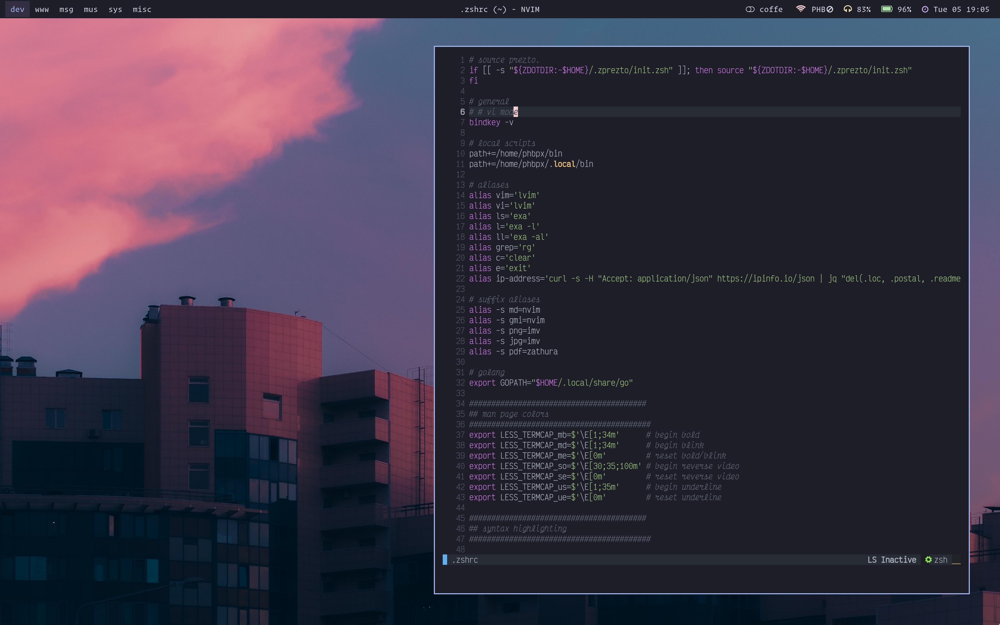

# dotfiles
My dotfiles repo, where you can find all my window managers and apps configurations.

# Software I use
| Software | Name |
| ------ | ------ |
| Distro | [archlinux](http://archlinux.org/) |
| WM | [sway](https://swaywm.org/) |
| Login Manager | - |
| Status bar | [waybar](https://github.com/Alexays/Waybar) |
| Screen locker | [swaylock-effects](https://github.com/mortie/swaylock-effects) |
| Launcher | [wofi](https://hg.sr.ht/~scoopta/wofi) |
| Notifications | [mako](https://github.com/emersion/mako) |
| Terminal emulator | [foot](https://codeberg.org/dnkl/foot/) |
| Shell | [zsh](https://www.zsh.org/) + [prezto](https://github.com/sorin-ionescu/prezto) |
| Prompt | [starship](https://starship.rs/)
| Browser | [Firefox](https://www.mozilla.org/pt-BR/firefox/new/) + qutebrowser |
| IDE'S | [vscodium](https://vscodium.com/), [lunarvim](https://www.lunarvim.org/) |
| Image viewer | [imv](https://sr.ht/~exec64/imv/), [sxiv](https://wiki.archlinux.org/title/Sxiv) |
| Video/Audio player | [mpv](https://wiki.archlinux.org/title/Mpv) |
| Music player | spotify |
| Screenshots | [grim](https://sr.ht/~emersion/grim/), [slurp](https://github.com/emersion/slurp), [swappy](https://github.com/jtheoof/swappy) |
| Document viewer | [zathura](https://wiki.archlinux.org/title/Zathura) |
| GTK theme | [catppuccin](https://www.gnome-look.org/p/1715554) |
| Icon theme | [fluent-dark](https://www.gnome-look.org/p/1477945) |
| Fonts | [VictorMono](https://www.nerdfonts.com/font-downloads), [OperatorMono](https://www.typography.com/fonts/operator/styles) |

# Screenshots

